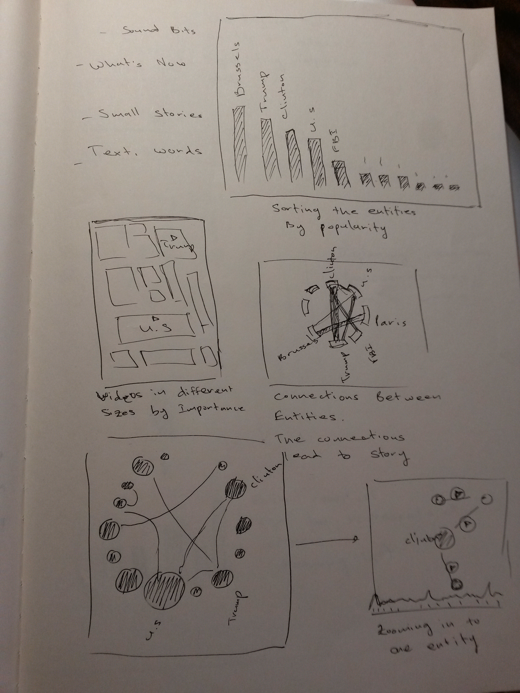
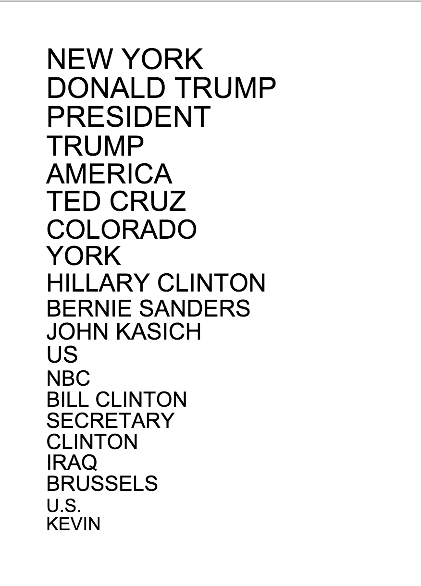
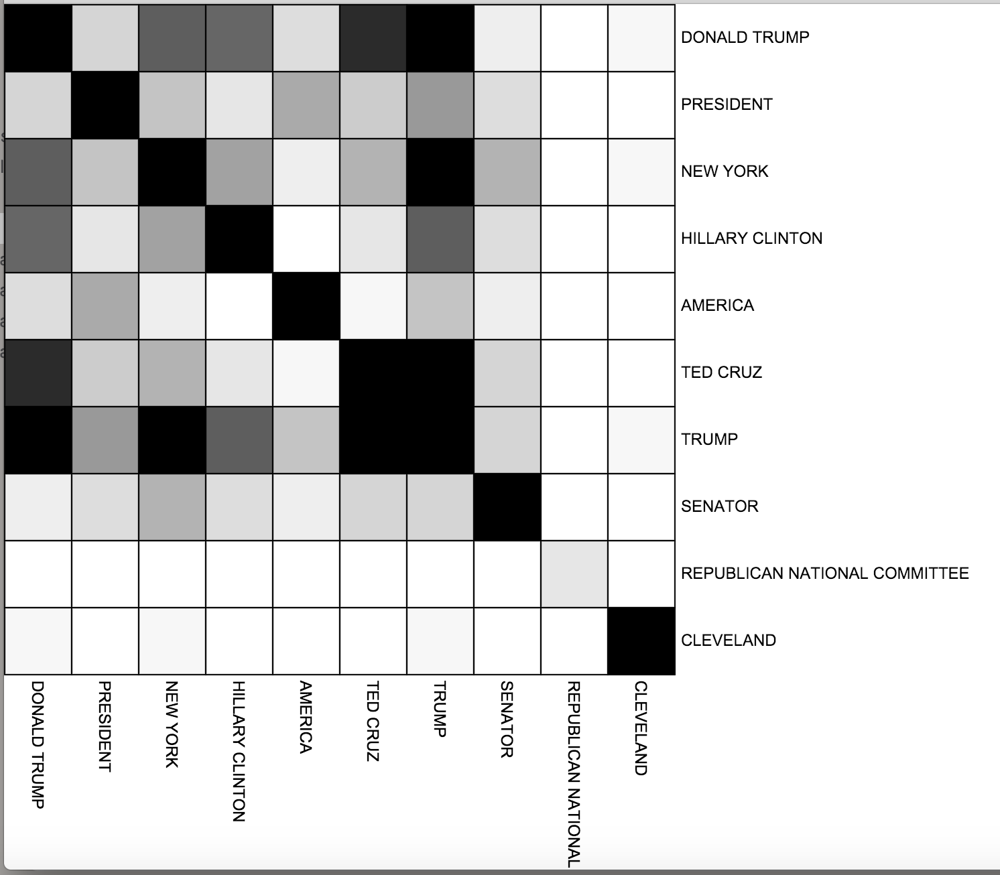
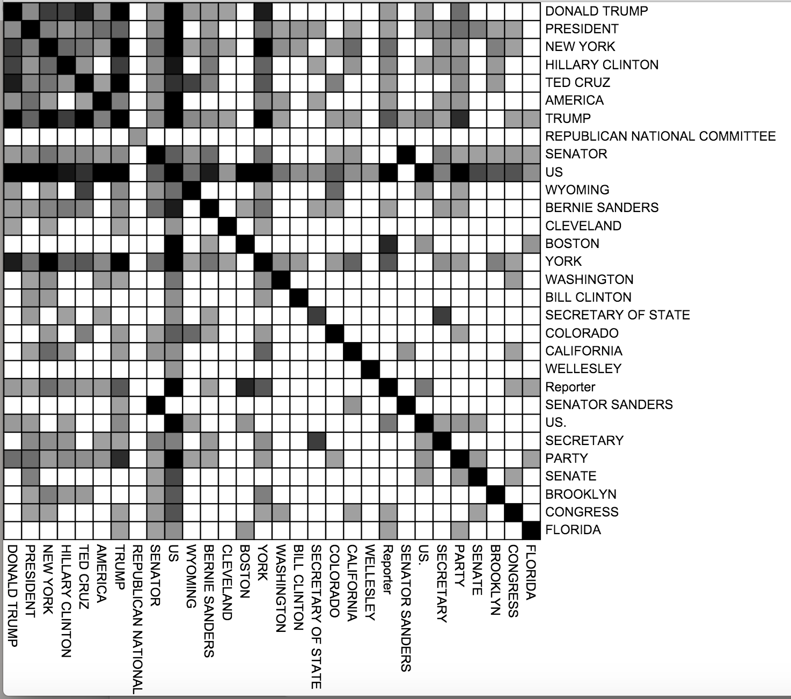
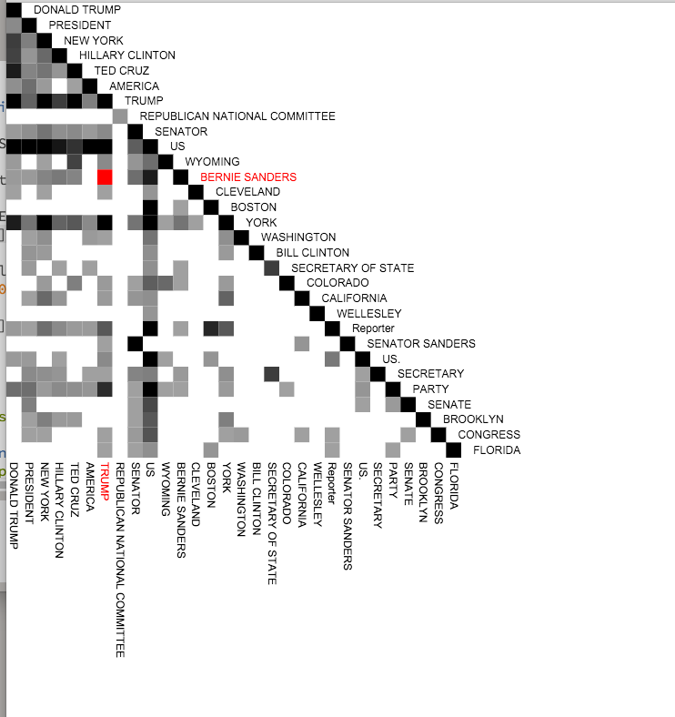
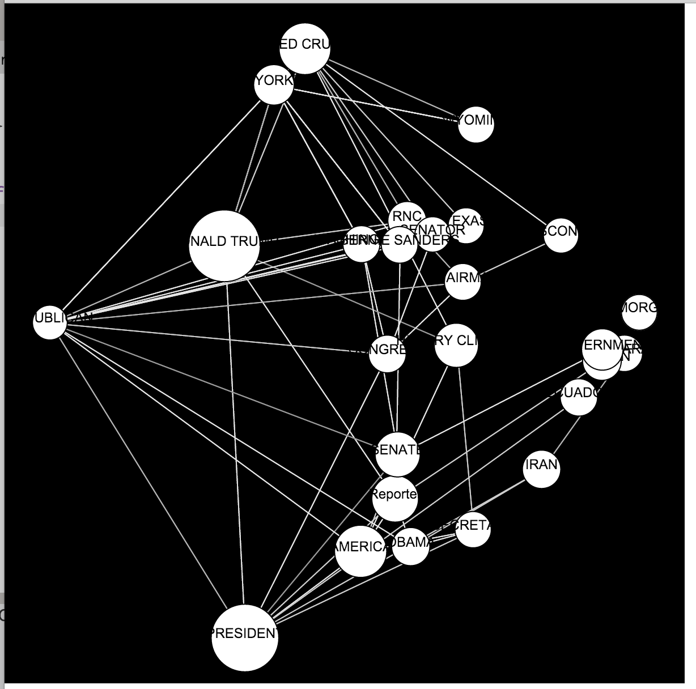
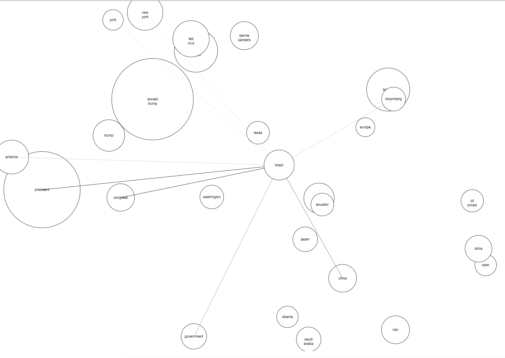
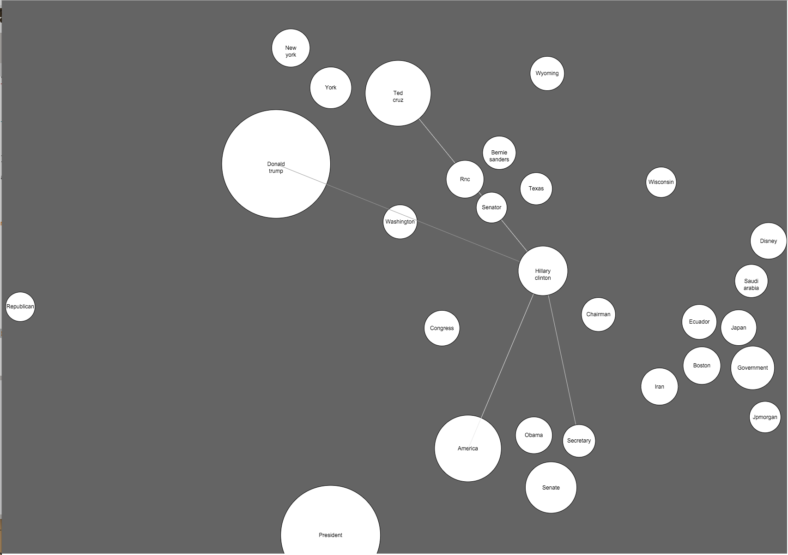
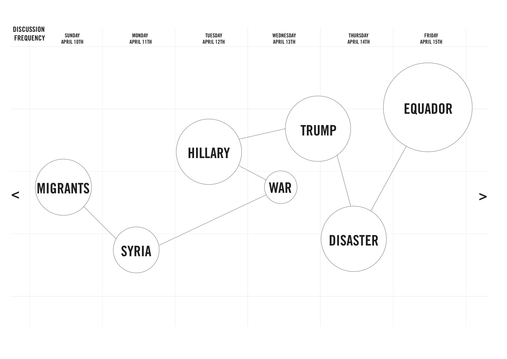

### Jasmin Rubinovitz  
4/21/2016  
4s50 Information Design  
 

# Final Project  - Representations

## Sketches

## code  
showing the top entities, text size mapped to number of mentions  
  

cross referencing 2 data sources in order to find connections. The matrix doesn't make much sense   
   

 
  
  

Using just super-glue data. a square is colored if 2 entities were mentioned in the same sentence in the closed captions   
    
    

  
Plotting the network in another way    
  

 
  
text size shows the number of mentions. color of the lines matched the number of mentions together.  
  

Moving to circles. the location is determined using PCA on the adjacency matrix.   
  

  

  

Trying the d3.js circles packing algorithm for circles locations   
  

 

### More Ideation:  

For the final version. I want to show how the connections and sizes of entities change across time.  
When hovering on a circle, the related circles will highlight. Then, clicking on any of the highlighted circles will show a relevant video bit that talks about these 2 entities  

  

  

