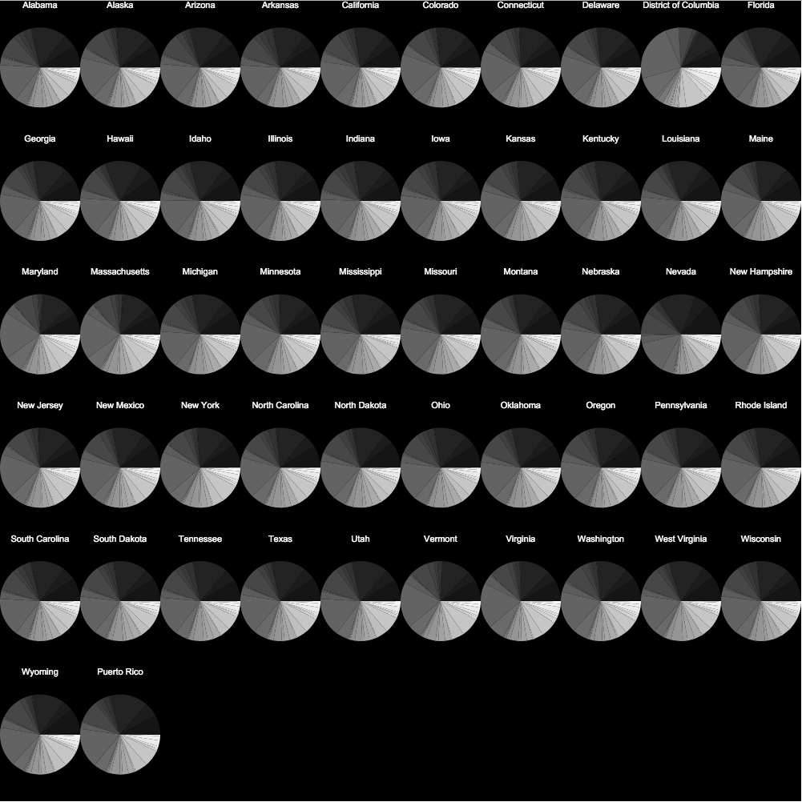
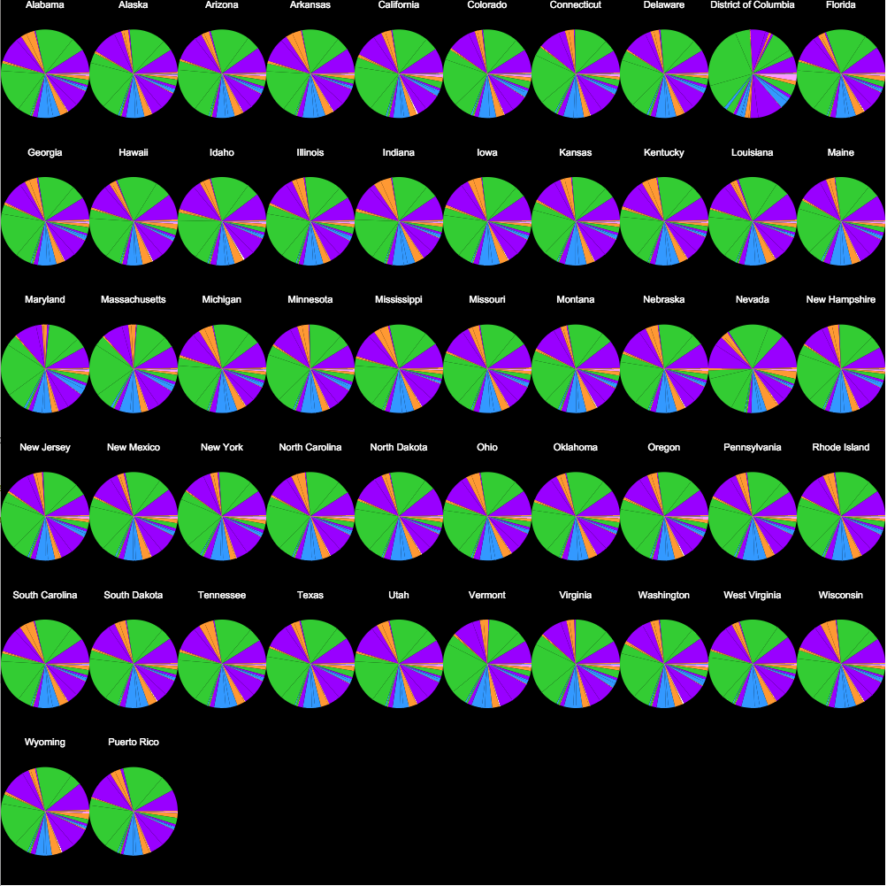
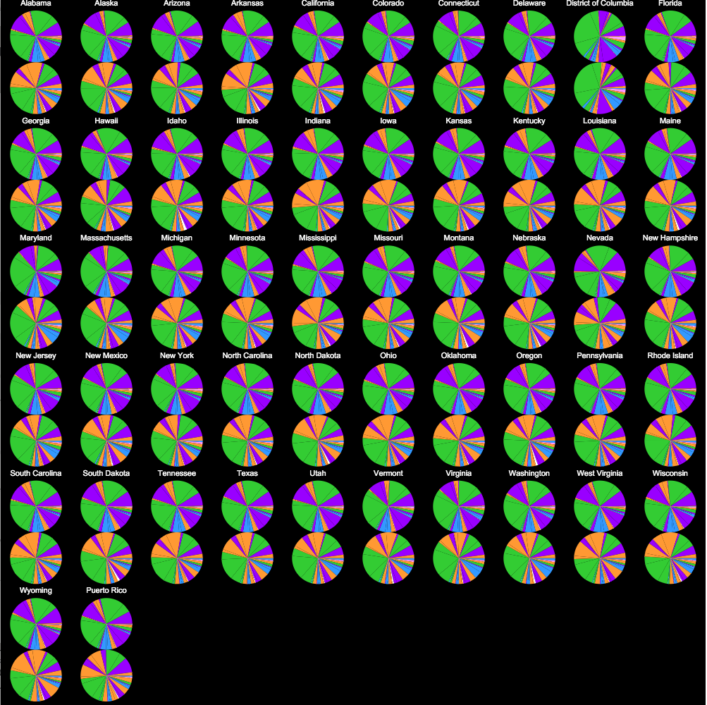
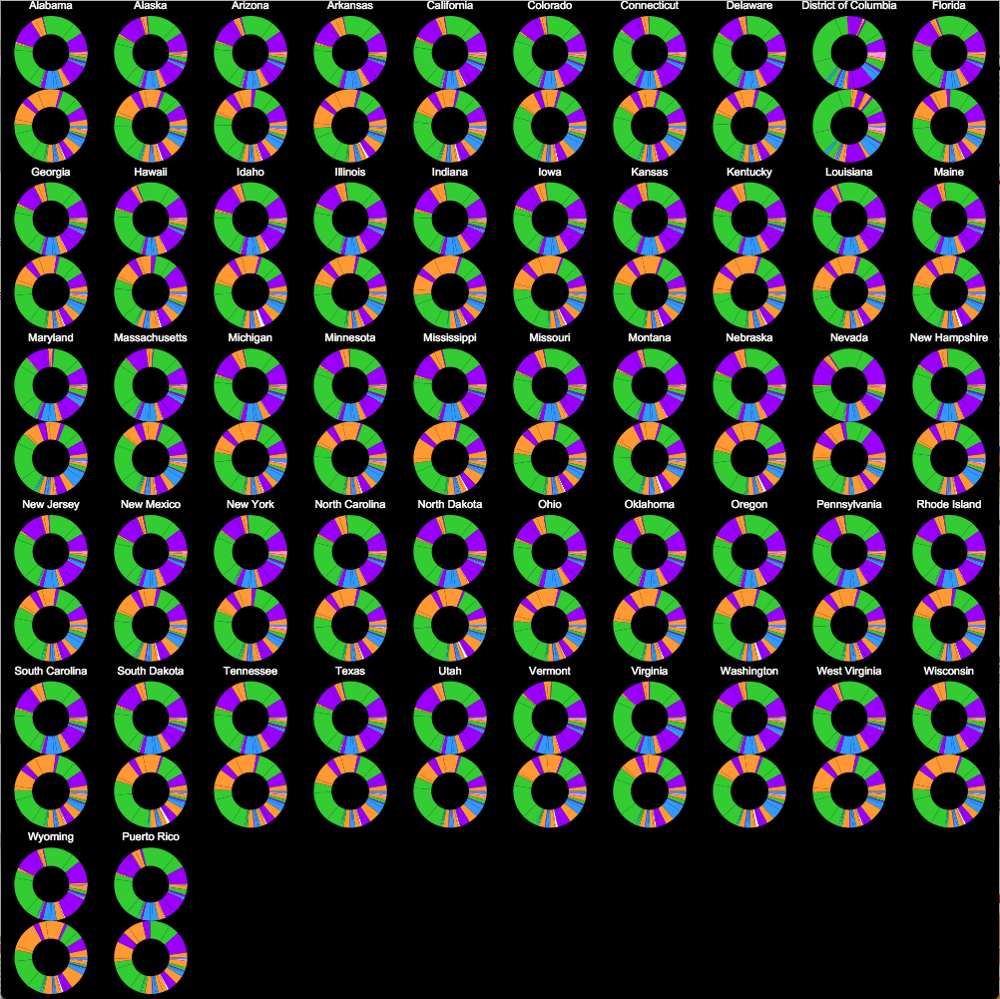
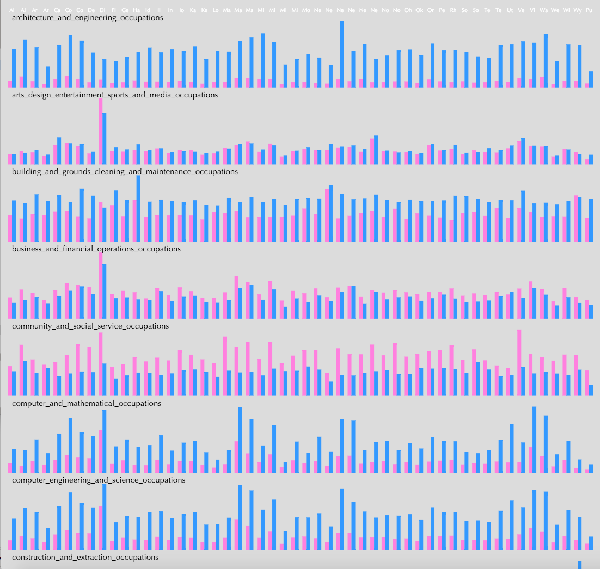
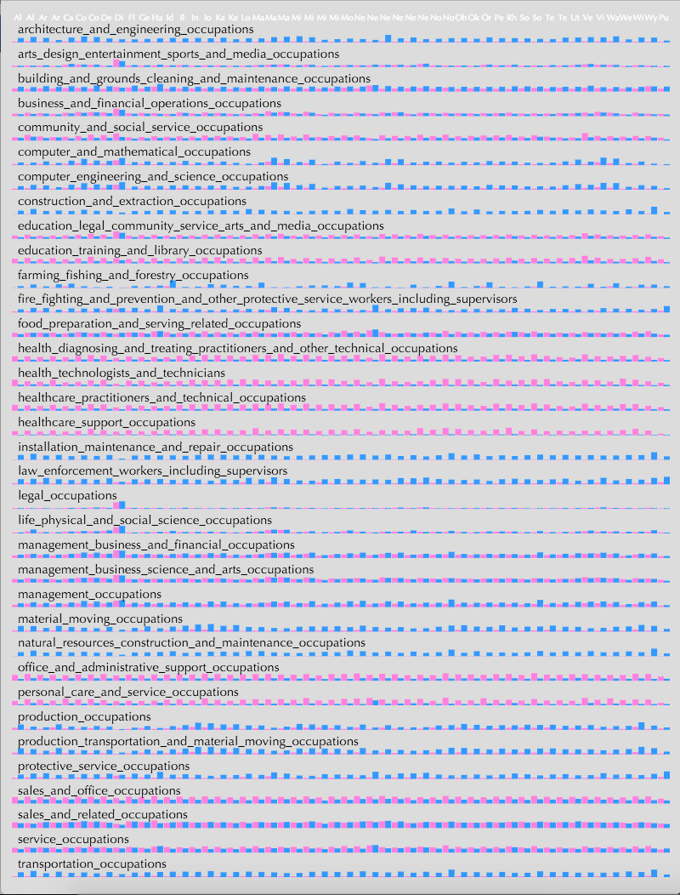
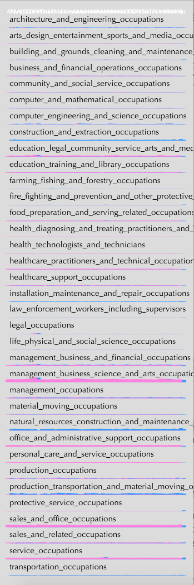
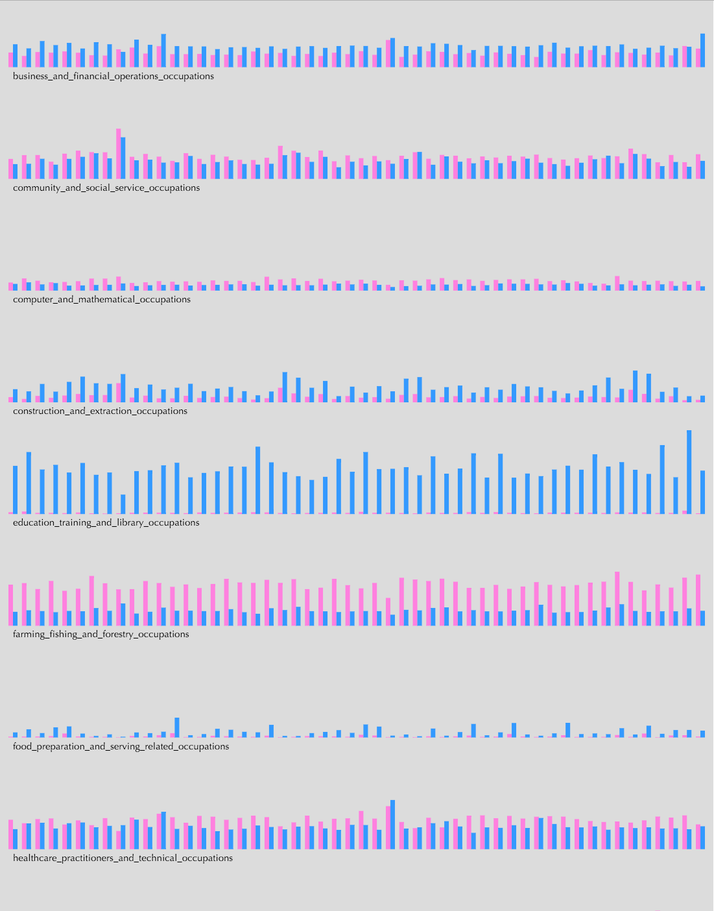
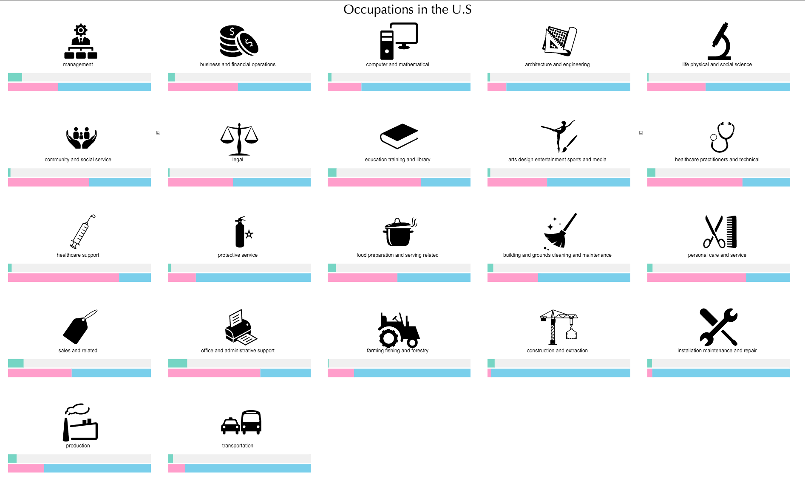

Jasmin Rubinovitz  
10/3/2016  
4s50 Information Desgin  
  
# Mapping  - Data Exploration

Some pie charts  

categorizing the occupations to 5 colors, adding male/female comparison  

Playing around with some bar charts:  

 

Looking at the data by occupation:  

Crit - 
Bars - seperate male and female do no jumps, start from center
Icons smaller then text
Group different occupations - 3-5 groups - when zooming in show all